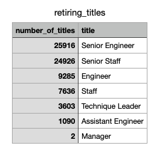
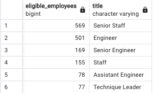

# Pewlett-Hackard-Analysis

# Overview
Objective is to 1) identify employees eligible to participate in the mentorship program 2) find the number of soon to be retiring employees and their positions. By uploading several employee datasets to a database and filtering them based on interested criteria- we are able to understand staffing needs. 

# Results
- Senior Engineer (25916) and Senior Staff (24926) positions have the most employees set to retire.
- Assistant Engineer (1090) and Manager (2) have the least amount of employees set to retire.
- There are total 1,549 employees across all departments eligible for the mentorship program.
- Senior Staff and Engineer have greatest number of eligible employees for mentorship program.

# Summary
72,485 roles will be impacted by the “silver tsunami” and will need to be filled. While there are many eligible mentors, not nearly enough to fill the gap of soon retiring staff. The company will have to source staff quickly.

  SELECT COUNT (emp_no) as eligible_employees, title
  FROM mentorship_eligibility
  GROUP BY title
  ORDER BY eligible_employees

We can use count and groupby to breakdown employees mentorship eligibility by department to see what areas need more manpower. 
